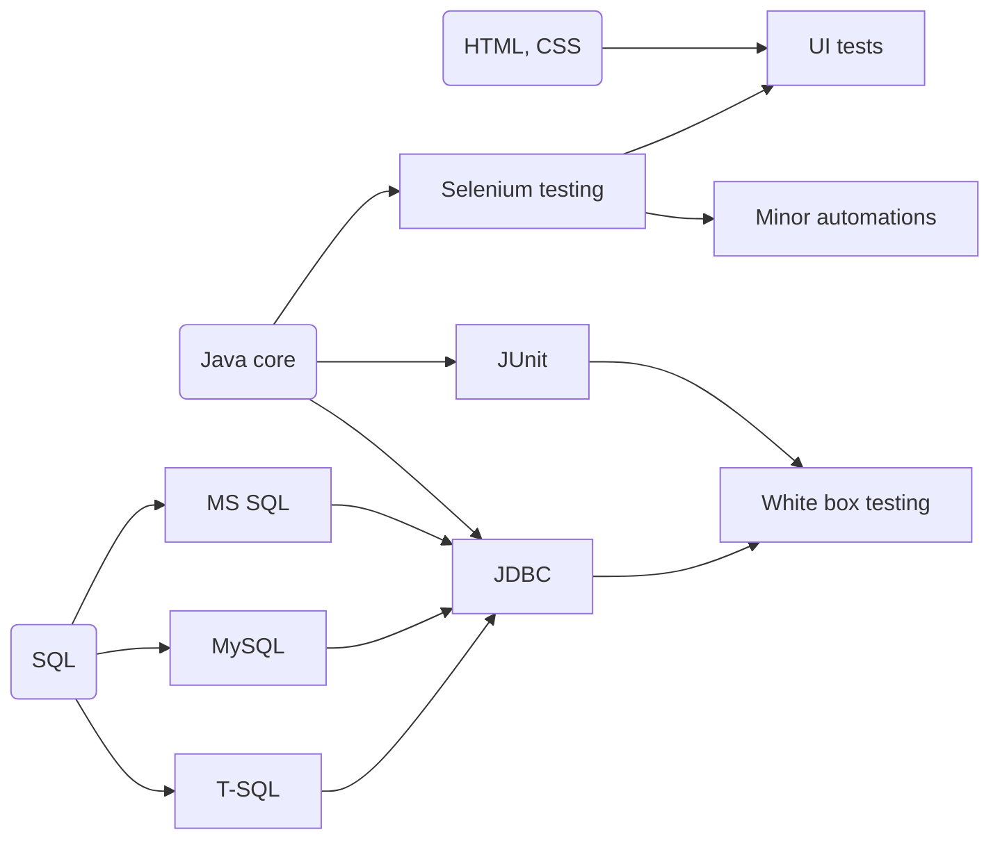

- 👋 Hi, I’m @Eekain
- 👀 I’m interested in Java, BASH, SQL, Testing & Automation
- 🌱 I’m currently learning Java
- 💞️ I’m looking to collaborate on what I'm able to.

The basic site that I'm (usually not) working on:
*[Github host page](https://eekain.github.io)*
(Click with caution and Ctrl / CMD)
<!---
Eekain/Eekain is a ✨ special ✨ repository because its `README.md` (this file) appears on your GitHub profile.
You can click the Preview link to take a look at your changes. For some reason it didn't allow opening page in new page....

OOOkay, so Mermaid works nicely
--->

So far I'm familiar with:

